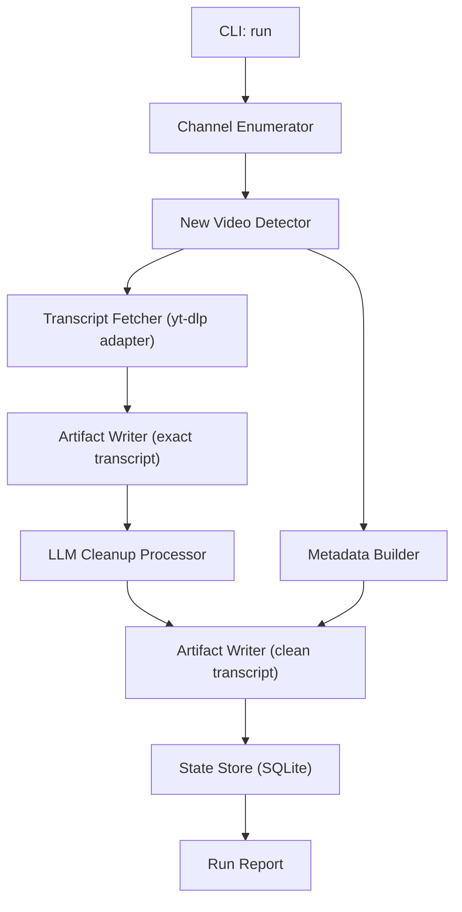

# Design: lunduke-transcripts

> Architecture and technical design for a local-first YouTube transcript pipeline.

---

## 1. Goals and Scope

This design implements the requirements in [product-definition.md](product-definition.md):

- Run on demand or on a schedule.
- Detect newly published videos and avoid duplicate processing.
- Persist exact transcript output and cleaned transcript output.
- Capture useful video/transcript metadata for future analysis.

MVP focus is reliability, traceability, and simple operations on a single machine.

---

## 2. Stack Choice

## Recommended Stack (MVP)

- Language: Python 3.10+
- Packaging/CLI: `setuptools` + stdlib `argparse` (move to `typer` only if UX needs grow)
- Video/transcript acquisition: `yt-dlp` (invoked as a subprocess)
- Data modeling/validation: `pydantic` (or stdlib dataclasses in slice 1)
- Storage:
  - SQLite for durable state and run logs
  - filesystem artifacts (`.vtt`, `.md`, `.json`)
- Scheduling:
  - external scheduler (`cron` or `launchd`)
  - app always exposes a single idempotent command for scheduler use
- LLM cleanup provider: adapter interface (OpenAI first, swappable)

## Why Python Is the Right Default

- Best ecosystem for text processing and LLM integrations.
- Fast development for file and process orchestration.
- Easy local scheduling/invocation.
- No clear advantage from switching to another stack for this workload.

## If We Needed a Different Stack

Only consider Go/Rust if startup footprint and binary-only distribution become top priorities. For this project, that tradeoff slows iteration without a significant product gain.

---

## 3. High-Level Architecture



Design principle: isolate external fragility (YouTube extraction, LLM provider) behind adapters; keep domain logic internal and testable.

---

## 4. Module Layout (Proposed)

Current package path should be normalized to `src/lunduke_transcripts/` (underscore) for valid Python imports.

```text
src/lunduke_transcripts/
  main.py                 # CLI entrypoint
  config.py               # config loading + defaults
  domain/
    models.py             # typed models (video, transcript, run status)
  app/
    orchestrator.py       # run pipeline
  infra/
    youtube_adapter.py    # yt-dlp invocation/parsing
    llm_adapter.py        # cleanup provider interface
    storage.py            # SQLite + filesystem IO
  transforms/
    transcript_cleaner.py # prompt building + post-processing rules
    vtt_parser.py         # exact transcript parsing/rendering
```

---

## 5. Data Model

## SQLite Tables

### `videos`
- `video_id` (PK)
- `channel_id`
- `channel_name`
- `title`
- `description`
- `published_at` (UTC ISO timestamp)
- `duration_seconds`
- `video_url`
- `first_seen_at`
- `last_seen_at`

### `transcripts`
- `id` (PK)
- `video_id` (FK)
- `language`
- `source_type` (`manual|auto|unavailable|unknown`)
- `exact_hash` (content hash)
- `exact_path`
- `exact_text_path` (optional no-timestamp render)
- `clean_path` (nullable if cleanup disabled/failed)
- `captured_at`

### `runs`
- `run_id` (PK)
- `started_at`
- `finished_at`
- `status` (`success|partial|failed`)
- `filter_from` (nullable UTC ISO timestamp)
- `filter_to` (nullable UTC ISO timestamp)
- `videos_seen`
- `videos_new`
- `videos_processed`
- `videos_failed`
- `error_summary`

### `run_items`
- `id` (PK)
- `run_id` (FK)
- `video_id`
- `step` (`discover|fetch|clean|write`)
- `status`
- `message`

## Filesystem Artifacts

```text
data/
  db/lunduke_transcripts.sqlite3
  videos/<video_id>/
    metadata.json
    transcript_exact.vtt
    transcript_exact.md
    transcript_clean.md
  runs/<run_id>.json
```

SQLite is source of truth for state; JSON/Markdown artifacts are user-facing outputs.

---

## 6. Pipeline Behavior

## Manual Run

Command:

```bash
lunduke-transcripts run --config config/channels.toml
```

Steps:
1. Load config and init storage.
2. Enumerate videos per channel.
3. Upsert discovered videos.
4. Select unprocessed/new videos.
5. Fetch captions/transcripts via adapter.
6. Write exact outputs.
7. Run optional cleanup pass and write cleaned output.
8. Persist per-video status and run summary.

## Date-Range Run (Optional)

Command examples:

```bash
lunduke-transcripts run --config config/channels.toml --from 2026-02-01 --to 2026-02-29
lunduke-transcripts run --config config/channels.toml --from 2026-02-01
lunduke-transcripts run --config config/channels.toml --to 2026-02-29
```

Behavior:
1. Parse date filters using configured app timezone.
2. Convert boundaries to UTC timestamps for filtering and persistence.
3. Filter candidate videos by `published_at` inclusive boundaries.
4. Apply normal idempotency rules after filter match (skip already processed unless reprocess flag is set).

## Scheduled Run

Use the same command via scheduler:

- `cron` example: `15 * * * * cd /path && lunduke-transcripts run --config ...`
- `launchd` equivalent on macOS.

No special scheduler mode in app logic; idempotency handles repeat invocation safely.

---

## 7. Exact vs Clean Transcript Rules

## Exact Transcript
- Never paraphrase.
- Preserve available timing.
- Keep a raw canonical file (`.vtt`) plus a readable render (`.md`).

## Clean Transcript
- Input is exact transcript text.
- Allowed edits: punctuation, paragraphing, clear disfluency cleanup.
- Disallowed edits: summarization, factual changes, invention.
- Save prompt metadata and model identifier in `metadata.json` for traceability.

---

## 8. Failure Handling

- Missing captions: mark as `unavailable`, continue.
- yt-dlp transient failure: retry with backoff (bounded).
- LLM failure: keep exact transcript, mark clean step failed, continue.
- One video failure must not fail entire run.
- Run returns non-zero only when system-level failure prevents meaningful processing.

---

## 9. Configuration

`config/channels.toml` (example):

```toml
[app]
data_dir = "data"
default_language = "en"
timezone = "America/Chicago"
enable_cleanup = true

[llm]
provider = "openai"
model = "gpt-4.1-mini"

[[channels]]
name = "Example Journalist"
url = "https://www.youtube.com/@example/videos"
language = "en"
```

Configuration is explicit file-based for reproducibility; CLI flags may override.

### CLI Contract (MVP)
- `--from YYYY-MM-DD` optional publish-date lower bound (inclusive)
- `--to YYYY-MM-DD` optional publish-date upper bound (inclusive)
- `--reprocess` optional flag to process already handled videos that match filters

---

## 10. Security and Compliance Notes

- Treat transcripts as third-party content; keep usage within user’s legal/policy boundaries.
- Keep API keys in environment variables; never in repo files.
- Log minimally; avoid leaking secrets in run reports.

---

## 11. Testing Strategy

1. Unit tests
- VTT parse/render behavior.
- New-video detection/idempotency.
- Cleanup guardrails (no summary/invention prompt contract).

2. Integration tests
- Mocked yt-dlp adapter end-to-end run.
- SQLite state transitions across two consecutive runs.

3. Test As Lee
- Run CLI manually against one known channel.
- Validate outputs in `data/videos/<video_id>/`.
- Re-run and confirm zero duplicates.

---

## 12. Implementation Plan (Slices)

## Slice 1: Exact Transcript MVP
- Normalize package path to `lunduke_transcripts`.
- Implement config + orchestrator + yt-dlp adapter + SQLite state.
- Implement optional `--from/--to` published-date filters.
- Write metadata and exact transcript outputs.

## Slice 2: Cleanup Pass
- Add LLM adapter with provider abstraction.
- Add clean transcript generation and persistence.
- Add cleanup provenance in metadata.

## Slice 3: Scheduling + Hardening
- Add scheduler docs/scripts.
- Add retries, richer run reports, and operational logging.
- Expand multi-channel ergonomics.

---

## 13. Open Decisions

1. Default cleanup model and max token budget.
2. How aggressive disfluency cleanup should be.
3. Whether to keep both `.md` and `.txt` cleaned outputs in MVP.
4. Maximum safe default backfill window for first run (if user sets no date range).

---

Last updated: 2026-03-04
