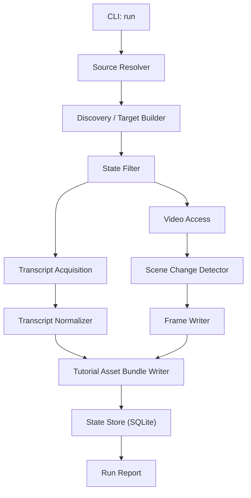

# Design: lunduke-transcripts

> Architecture and technical design for a local-first transcript and frame-extraction pipeline.

---

## 1. Goals and Scope

This design implements the current requirements in [product-definition.md](product-definition.md):

- ingest video from YouTube and local files
- extract exact transcript artifacts
- normalize transcript data into JSON
- capture significant frame candidates as image files
- write a canonical tutorial asset bundle for later renderers

Current phase focus is reliability, traceability, stable extraction artifacts, and
a multi-agent written-tutorial pipeline built on top of the canonical bundle.

---

## 2. Stack Choice

## Recommended Stack

- Language: Python 3.11+
- Packaging/CLI: `setuptools` + stdlib `argparse`
- YouTube acquisition: `yt-dlp` (invoked as a subprocess)
- Local/remote media processing: `ffmpeg` / `ffprobe`
- ASR fallback: provider plugin interface (`fast-whisper` first implementation)
- Storage:
  - SQLite for durable state and run logs
  - filesystem artifacts (`.vtt`, `.md`, `.txt`, `.json`, `.jpg`)
- Scheduling:
  - external scheduler (`cron` or `launchd`)
  - app exposes one idempotent command for scheduler use

## Why This Stack Still Fits

- Python remains the fastest path for orchestration, file IO, text transforms, and later LLM integration.
- `ffmpeg` already fits the media-processing boundary needed for frame extraction.
- SQLite remains adequate because the source of truth is local and append-oriented.

---

## 3. High-Level Architecture



Design principle: external volatility stays behind adapters, while transcript/frame
normalization and bundle generation stay internal and testable.

---

## 4. Core Architectural Direction

### 4.1 Canonical Intermediate Artifacts

The next phase should not generate final tutorials directly. It should generate a
canonical tutorial asset bundle made of:

- `transcript.json`
- `frame_manifest.json`
- `tutorial_asset_bundle.json`
- referenced artifact files on disk

This makes later renderers format-only concerns rather than reprocessing concerns.

### 4.2 Images Stay on Disk

Frame image bytes are not embedded in JSON.

Instead:
- frames are written under `frames/`
- JSON stores relative paths, timestamps, and scoring metadata
- later renderers dereference those paths

This keeps JSON small, diffable, inspectable, and reusable.

### 4.3 Hybrid Frame Strategy

Frame selection should be two-stage:

1. deterministic extraction of visual candidates using scene-change detection
2. later optional scoring/selection based on transcript content or LLM reasoning

This phase implements stage 1 and also adds a downstream multi-agent tutorial
pipeline that consumes the canonical bundle.

---

## 5. Module Layout

```text
src/lunduke_transcripts/
  main.py
  config.py
  domain/
    models.py                  # source, transcript, frame, bundle models
  app/
    orchestrator.py
    single_video_transcriber.py
    tutorial_asset_builder.py  # compose canonical bundle
    tutorial_agent_registry.py # repo-local agent + skill loader
    tutorial_pipeline.py       # multi-agent tutorial orchestration
  infra/
    youtube_adapter.py         # yt-dlp invocation/parsing
    local_media_adapter.py     # local file probing and extraction helpers
    video_frame_extractor.py   # ffmpeg/ffprobe scene detection + frame writing
    llm_adapter.py
    asr_plugins/
      base.py
      fast_whisper.py
      registry.py
    storage.py
  transforms/
    vtt_parser.py
    transcript_json_writer.py
    tutorial_prompts.py
```

Notes:
- `youtube_adapter.py` remains responsible for YouTube discovery and caption access.
- `local_media_adapter.py` handles probing local files and sidecar subtitle discovery.
- `video_frame_extractor.py` owns frame candidate extraction only, not later semantic selection.
- `tutorial_pipeline.py` is downstream-only and never reruns transcript or frame extraction.

---

## 6. Data Model

## SQLite Tables

### `videos`
- `source_id` (PK)
- `source_kind` (`youtube_video|local_file`)
- `video_id` (nullable)
- `channel_id`
- `channel_name`
- `title`
- `description`
- `published_at` (UTC ISO timestamp, nullable)
- `duration_seconds`
- `video_url` (nullable)
- `local_path` (nullable)
- `artifact_dir`
- `first_seen_at`
- `last_seen_at`

### `transcripts`
- `source_id` (PK / FK)
- `language`
- `source_type` (`manual|auto|asr_fast-whisper|unavailable|unknown`)
- `exact_hash`
- `exact_path`
- `exact_text_path`
- `transcript_json_path`
- `captured_at`

### `frames`
- `id` (PK)
- `source_id` (FK)
- `frame_index`
- `timestamp_seconds`
- `image_path`
- `selection_kind` (`scene_candidate|selected`)
- `scene_score` (nullable)
- `notes` (nullable)

### `runs`
- `run_id` (PK)
- `started_at`
- `finished_at`
- `status`
- `filter_from`
- `filter_to`
- `videos_seen`
- `videos_new`
- `videos_processed`
- `videos_failed`
- `error_summary`

### `run_items`
- `id` (PK)
- `run_id` (FK)
- `source_id`
- `step` (`discover|fetch|normalize|frames|bundle|write`)
- `status`
- `message`

## Filesystem Artifacts

```text
data/
  db/lunduke_transcripts.sqlite3
  videos/<artifact_dir>/
    metadata.json
    transcript_exact.vtt
    transcript_exact.md
    transcript_exact.txt
    transcript.json
    frame_manifest.json
    tutorial_asset_bundle.json
    frames/
      000123.jpg
      000456.jpg
  runs/<run_id>.json
```

SQLite is source of truth for state. JSON artifacts are the portable contract for downstream tools.

## Tutorial Artifacts

Tutorial generation writes under `videos/<artifact_dir>/tutorial/`:

- `tutorial_definition.json`
- `lesson_outline.json`
- `evidence_map.json`
- `frame_selection_plan.json`
- `tutorial_draft.md`
- `tutorial_validation_report.json`
- `technical_review_report.json`
- `adversarial_review_report.json`
- `tutorial_revision_plan.json`
- `tutorial_manifest.json`
- `tutorial_final.md`

---

## 7. Canonical JSON Contracts

## `transcript.json`

Purpose: normalized, timing-preserving transcript data derived from captions or ASR.

Example shape:

```json
{
  "schema_version": "1",
  "source_id": "youtube:abc123",
  "source_kind": "youtube_video",
  "title": "Example Video",
  "language": "en",
  "transcript_source": "auto",
  "artifacts": {
    "exact_vtt": "transcript_exact.vtt",
    "exact_markdown": "transcript_exact.md",
    "exact_text": "transcript_exact.txt"
  },
  "segments": [
    {
      "segment_index": 0,
      "start_seconds": 0.0,
      "end_seconds": 4.32,
      "start_timestamp": "00:00:00.000",
      "end_timestamp": "00:00:04.320",
      "text": "Welcome to the tutorial."
    }
  ]
}
```

## `frame_manifest.json`

Purpose: all extracted frame candidates with file references and extraction metadata.

Example shape:

```json
{
  "schema_version": "1",
  "source_id": "youtube:abc123",
  "extraction_method": "ffmpeg_scene_detect",
  "threshold": 0.25,
  "frames": [
    {
      "frame_index": 0,
      "timestamp_seconds": 12.4,
      "timestamp": "00:00:12.400",
      "image_path": "frames/000000.jpg",
      "selection_kind": "scene_candidate",
      "scene_score": 0.41
    }
  ]
}
```

## `tutorial_asset_bundle.json`

Purpose: one manifest that points to everything later renderers need.

Example shape:

```json
{
  "schema_version": "1",
  "source_id": "youtube:abc123",
  "source_kind": "youtube_video",
  "title": "Example Video",
  "metadata_path": "metadata.json",
  "transcript_path": "transcript.json",
  "frame_manifest_path": "frame_manifest.json",
  "frame_capture": {
    "status": "captured",
    "error": null
  },
  "artifacts": {
    "exact_vtt": "transcript_exact.vtt",
    "exact_markdown": "transcript_exact.md",
    "exact_text": "transcript_exact.txt"
  }
}
```

The bundle stays thin. It references other JSON and file artifacts rather than duplicating them. When frame capture is disabled or fails, `frame_manifest_path` is `null` and `frame_capture` carries the explicit status.

---

## 8. Pipeline Behavior

## Manual Run

Command examples:

```bash
lunduke-transcripts run --video-url "https://www.youtube.com/watch?v=VIDEO_ID"
lunduke-transcripts run --video-file "/path/to/video.mp4"
```

Steps:
1. Load config and initialize storage.
2. Resolve targets from channels, explicit video URLs, and local files.
3. Upsert discovered source metadata.
4. Apply date-range and idempotency filters.
5. Acquire transcript from captions, sidecar subtitles, or ASR.
6. Write exact transcript artifacts.
7. Normalize to `transcript.json`.
8. Acquire accessible video media for frame extraction.
9. Run scene-change detection and write frame files.
10. Write `frame_manifest.json`.
11. Write `tutorial_asset_bundle.json`, including explicit frame capture status.
12. Persist per-source status and run summary.

## Tutorial Run

Command examples:

```bash
lunduke-transcripts tutorial --bundle "/path/to/tutorial_asset_bundle.json"
lunduke-transcripts tutorial --bundle "/path/to/tutorial_asset_bundle.json" --approve-outline
```

Steps:
1. Load the canonical bundle plus transcript and frame manifest.
2. Load repo-local agent definitions from `agents/` and tutorial skills from `skills/`.
3. Run educator, planner, evidence mapper, and visual editor to produce the outline package.
4. Stop unless `--approve-outline` is present.
5. Draft Markdown from the approved plan.
6. Validate evidence, frame references, and metadata.
7. Run technical review and adversarial review.
8. Build a revision plan and reroute to the earliest stage that can fix the findings.
9. Re-run downstream stages up to the configured review-cycle limit.
10. Write `tutorial_final.md` for the latest approved run, even when review warnings remain.
11. Write `tutorial_manifest.json` with agent/skill digests, review outcomes, and editorial warnings for the latest run.

### Tutorial Authoring Contract

The live screencast validation in Sprint 11 clarified that the downstream
tutorial system is solving two different problems:

1. keep the runtime path reliable enough that Lee can regenerate artifacts
   end-to-end without stale outputs or silent hangs
2. turn a live workflow demonstration into a public artifact that is useful
   without inventing unsupported procedural detail

That leads to these design constraints:

- The tutorial pipeline should treat many screencasts as guided workflow
  walkthroughs, not guaranteed copy-paste setup guides.
- The opening context may explain purpose, audience, and payoff, but it should
  stay compact rather than spawning multiple weakly grounded pseudo-steps.
- The first actionable step should align with the interpreted core workflow,
  not incidental setup, even when the planner emits text-only setup ahead of it.
- Unsupported extension/roadmap guidance should stay out of the outline unless
  the transcript explicitly teaches it.
- If a screenshot is only weakly supportive, the system should either improve
  the surrounding explanation/caption or downgrade the step to justified
  text-only instead of pretending the image teaches the action.

### Source Interpretation and Pedagogy Guardrails

The planner no longer works from transcript chronology alone. It consumes a
`source_interpretation.json` artifact that identifies:

- the core workflow
- the learner payoff
- the best first real action
- setup or contextual steps to demote

This artifact exists because prompt-only planner coaching was not strong enough
in live runs. The real screencast repeatedly tried to foreground project-folder
setup and generic motivation before the actual workflow. The pipeline now uses
source interpretation plus deterministic outline normalization to keep the first
actionable section aligned with the interpreted core action.

### Runtime Budget and Failure Semantics

Live Lee runs also exposed a second design issue: routed tutorial stages can
take longer than the original 60-second budget, especially `tutorial.evidence`.

Current contract:

- routed tutorial stages use an explicit wall-clock timeout budget
- wrapped router timeouts must surface as machine-readable
  `llm_router_timeout[...]` errors
- `tutorial --reprocess` must clear stale final artifacts before starting
- a successful publish path must refresh downstream HTML/PDF by default

This keeps the live CLI bounded and debuggable while avoiding the earlier state
where an interrupted or stalled run could leave an older PDF looking current.

## Date-Range Run

- YouTube channel and video sources use `published_at` when available.
- Local files usually do not have a meaningful publish date; if date filtering is requested and no publish date exists, skip with a clear run-item reason.

## Scheduled Run

Use the same idempotent command via scheduler. No separate scheduler mode exists.

---

## 9. Transcript Acquisition Strategy

Priority order by source type:

### YouTube video
1. explicit captions/subtitles via `yt-dlp`
2. automatic captions via `yt-dlp`
3. ASR fallback if enabled

### Local file
1. matching sidecar subtitles when present (`.vtt`, `.srt`)
2. ASR fallback if enabled

Normalization rule:
- regardless of source, all transcript paths converge into exact transcript artifacts plus `transcript.json`

---

## 10. Frame Extraction Strategy

### 10.1 Candidate Extraction

Use `ffmpeg` scene detection to extract frame candidates, for example:

- detect meaningful visual changes
- capture one frame per detected change boundary
- store scene score where available

### 10.2 Why Not LLM-Only Selection

LLM-only frame picking based on transcript content is insufficient because:

- it does not know whether the frame is visually informative
- it cannot detect slide changes or UI changes directly
- it tends to choose semantically important moments that may have poor screenshots

### 10.3 Why Not Visual-Only Final Selection

Visual-only detection over-produces frames and cannot know which frames are instructionally useful.

Therefore:
- this phase extracts candidates and records their metadata
- a later phase may score or select instructional frames using transcript alignment or an LLM

---

## 11. Failure Handling

- Missing captions: mark as `unavailable`, continue.
- Missing captions with ASR enabled: attempt ASR fallback and continue if ASR fails.
- Missing sidecar subtitles for local files: fall back to ASR when enabled.
- Media unavailable for frame extraction: transcript artifacts may still succeed; mark frame step failed separately.
- `yt-dlp` transient failure: retry with backoff.
- `ffmpeg`/`ffprobe` failure: log `frames` step with actionable reason, continue run.
- Missing LLM credentials for tutorial generation: fail the tutorial command with a machine-readable error payload.
- Review failure after max cycles: write revision artifacts and block publish eligibility.
- One source failure must not fail the entire run.
- Run returns non-zero only when a system-level failure prevents meaningful processing.
- Routed tutorial-stage timeout failures must be explicit and actionable rather
  than surfacing as empty router errors or silent hangs.

---

## 12. Configuration Direction

Current config should evolve to support:

```toml
[app]
data_dir = "data"
default_language = "en"
timezone = "America/Chicago"
enable_asr_fallback = true
frame_capture_enabled = true
frame_capture_threshold = 0.25
frame_image_format = "jpg"
ffmpeg_binary = "ffmpeg"
ffprobe_binary = "ffprobe"

[[videos]]
name = "Specific YouTube Video"
url = "https://www.youtube.com/watch?v=VIDEO_ID"
language = "en"

[[files]]
name = "Local Demo Video"
path = "/absolute/path/demo.mp4"
language = "en"
```

CLI should evolve to include:
- `--video-file /path/to/file.mp4`
- existing `--video-url`
- existing `--channel-url`

---

## 13. Testing Strategy

1. Unit tests
- transcript JSON normalization from VTT/ASR segments
- source identifier generation for local files vs YouTube
- frame manifest generation and path formatting

2. Integration tests
- single-video YouTube path with mocked adapters
- local-file path with sidecar subtitle or mocked ASR
- run summary and idempotency across transcript + frame artifacts

3. Test As Lee
- run a YouTube video target end-to-end
- run a local `.mp4` end-to-end
- confirm transcript files, `transcript.json`, frame files, `frame_manifest.json`, and `tutorial_asset_bundle.json` exist

---

## 14. Implementation Plan

### Slice 1: Source-Agnostic Transcript Extraction
- add local file target model and CLI/config support
- generalize video metadata model to source-aware records
- write `transcript.json`

### Slice 2: Frame Candidate Extraction
- add media access path for frame extraction
- implement `video_frame_extractor.py`
- write frame files and `frame_manifest.json`

### Slice 3: Bundle Assembly
- write `tutorial_asset_bundle.json`
- persist references in SQLite and run reports

### Slice 4: Tutorial Quality Closeout
- collapse intro/context pseudo-steps into one compact context block
- add minimally actionable prompt/artifact examples for planning, sprinting,
  review, and run phases without inventing unsupported shell commands
- improve screenshot usefulness or justify more text-only steps when visuals are
  weak
- rerun the real screencast flow and accept the slice only if the final
  tutorial becomes less caveat-heavy and more learner-actionable
- document the stable JSON contracts for future renderers

---

## 15. Open Decisions

1. Whether local files should prefer sidecar subtitle files before ASR.
2. Whether frame extraction should capture all candidates or cap them by default.
3. Whether the first bundle should include only scene candidates or also transcript-aligned selections.
4. How aggressive semantic frame selection should be once scene candidates exist.

---

Last updated: 2026-03-06
